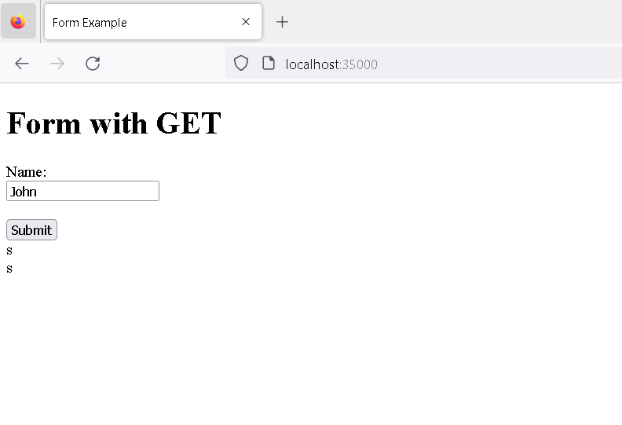
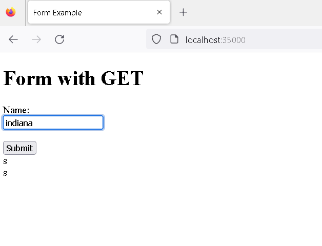
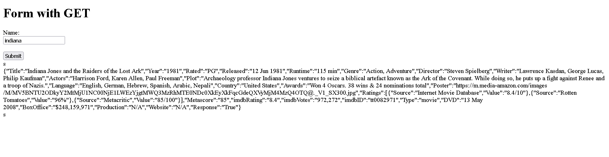
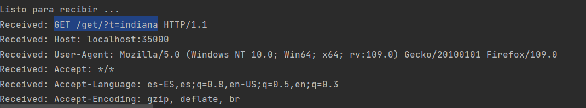
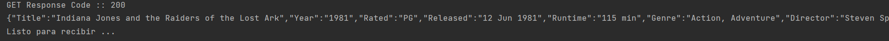
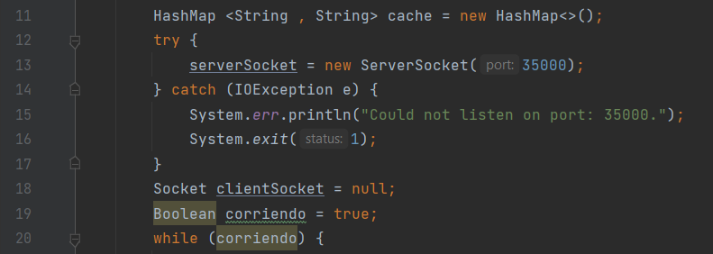
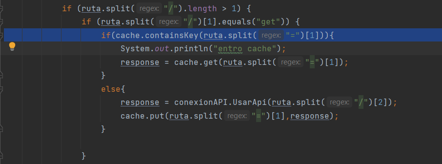
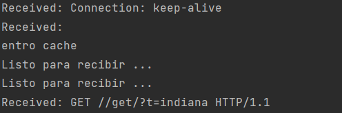

# TALLER 1: APLICACIONES DISTRIBUIDAS (HTTP, SOCKETS, HTML, JS,MAVEN, GIT)

> Trabajo que consta de crear dos clientes, uno de tipo ```java``` para pruebas y otro ```java script``` para representar graficamente el depliege web, estos clientes se comunicaran por medio de protocolos ```HTTP``` 
> para que sea alimentado por un api en la cual nos entregan un URL y una KEY para poder lograr hacer un GET de cada consulta

## Pre-requisitos

> Para  elaborar este proyecto requerimos de las siguientes tecnologias:
> * [Maven](https://es.wikipedia.org/wiki/Maven): Herramienta la cual permite realizar la construción de proyectos, realizarles pruebas y otras funciones.
> * [Git](https://es.wikipedia.org/wiki/Git): Software de control de versionamiento centralizado.
> 

## Instalación
>
> Antes de bajar el repositorio debemos saber que para visualizar correctamente el contenido de lo ```JSON``` que seran retornados es necesario instalar una extension, esta varia dependiendo del navegador y se encuentran a continación:
>
>  [Mozilla Firefox visualizador JSON](https://addons.mozilla.org/es/firefox/addon/json-lite/)
> 
> Ahora clonamos este repositario desde ```cmd```, con el siguiente comando
>
> ```
> git clone > git clone https://github.com/liontama2121/TALLER1_AREP_2023-1

> ```
> 
> Despues accedemos a la carpeta con el comando
> 
> ```
> cd TAREA1
> ```
> 
> Finalmente realizamos la construcción de nuestro proyecto en ```mvn``` con el siguiente comando
> ```
> mvn package
> ```

## Pruebas con ClientTest
> 
> Teniendo las el proceso de instalación completo, ahora podemos proceder a realizar nuestras pruebas locales, en nuestro caso seran ejecudo por medio de nuestro ```ClientTest``` y las podemos ejecutar del siguiente modo:
> Para mostrar que funciona el programa porcedemos a usar POSMAN con las sigiente indicaciones :
> 
> iniciar el programa y entrar  a local:35000 (recuerde que solo funciona en Mozilla Firefox)
> 
> engrese en du navegador a localhost:35000
> 
> 
> 
> despues entre la consulta que quiera  en este caso sera "indiana"
> 
> 
> 
> y se vera estos resultados 
> 
> 
>  tambien podemos notar que en consola se ve este resultado 
> 
> 
> 
>  
> 
> para pruebas del cache : 
> 
> 
>
> esto permitira que si se guarde la informacion el HashMap creado
>
> 
> 
>  
> 
> desmostrando que si funciona
> 
> 
>
> 
> 
> 
## Construido con

* [Maven](https://es.wikipedia.org/wiki/Maven): Herramienta la cual permite realizar la construción de proyectos, realizarles pruebas y otras funciones.
* [Git](https://es.wikipedia.org/wiki/Git): Software de control de versionamiento centralizado.
* [Intelij](https://es.wikipedia.org/wiki/IntelliJ_IDEA): es un entorno de desarrollo integrado (IDE) para el desarrollo de programas informáticos. Es desarrollado por JetBrains, y está disponible en dos ediciones: edición para la comunidad1 y edición comercial.
* [Java](https://www.oracle.com/java/): Lenguaje de programación de propósito general, es decir, que sirve para muchas cosas, para web, servidores, aplicaciones móviles, entre otros. Java también es un lenguaje orientado a objetos, y con un fuerte tipado de variables.
* [Html](https://desarrolloweb.com/home/html): Es un lenguaje de marcación que sirve para definir el contenido de las páginas web. Se compone en base a etiquetas, también llamadas marcas o tags, con las cuales conseguimos expresar las partes de un documento, cabecera, cuerpo, encabezados, párrafos, etc.
* [Java Script](https://es.wikipedia.org/wiki/JavaScript): Es un lenguaje de programación interpretado, dialecto del estándar ECMAScript. Se define como orientado a objetos, basado en prototipos, imperativo, débilmente tipado y dinámico.

## Autor
[Juan Camilo Molina Leon ](https://github.com/liontama2121)

## Licencia & Derechos de Autor
**©** Juan Camilo Molina Leon, Estudiante de Ingeniería de Sistemas de la Escuela Colombiana de Ingeniería Julio Garavito


